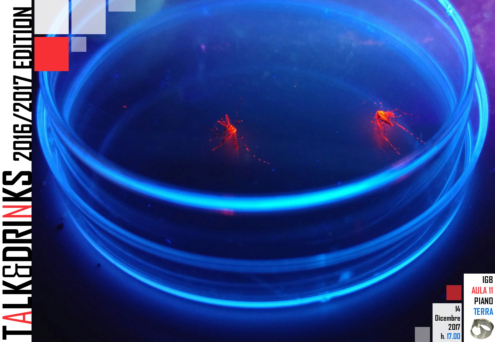
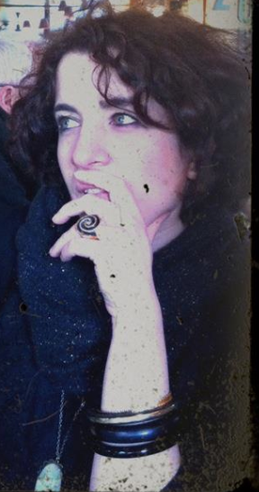

<h1>Upcoming</h1>

This is a paragraph.

<table style="width:100%">
  <tr>
     <td><h3>When?</h3>
     
Thursday December 14th- 5:00 pm

     </td>
     <td>
     </td>
  </tr>
</table>

<h3>Where?</h3>
Area di Ricerca P. Castellino  
via P.Castellino 111 Napoli  
Piano Rialzato - Stanza 11  
<a href="https://goo.gl/maps/z6bRfCnBibv">check on the map</a>

<h3>Who?</h3>

The only way to know who is the speaker is to come to the Talk&amp;Drinks! The identity of the guest will be kept secret until the very last minute.

<h1>What are Talk&amp;Drinks?</h1>

Talk&amp;Drinks is a relaxed scientific discussions that take place every month, usually on a Thursday afternoon. 

 We hosts a secret guest every time to discuss about science in a broad sense: we talk about genetics, physics archeology, computers, technology and more and more... 
  

 We foster creative collaborations and aim to establish a critical mass of scientists in the Research Area where we work. 

 Talk&amp;Drinks is an open event, if you want to subscribe to our low traffic mailing list
<a href="http://list.igb.cnr.it/mailman/listinfo/talk_and_drinks">click here</a>

 Talk&amp;Drinks is a self-supported event, we rely on your contribution, especially for ideas 

<h1>Who runs the Talk&amp;Drinks?</h1>

We are researchers with passion for science and a willingness to reach out and talk with people

<table style="width:100%">
  <tr>
     <td>Alessandra Rogato
     </td>
     <td>
     </td>
  <tr/>

  <tr>
    <td>Enza Colonna
    </td>
    <td>
    </td>
  <tr/>

  <tr>
     <td>Enza Lonardo
      </td>
      <td>
      </td>
  <tr/>

  <tr>
     <td>Valeria Tarallo
      </td>
      <td>
      </td>
  <tr/>

</table>

<h1>Past contributors </h1>
<table style="width:100%">
  <tr>
  <td>Edoardo De Tommasi
  </td>
  <td>
  </td>
<tr/>

<tr>
   <td>Ombretta Guardiola
    </td>
    <td>
    </td>
<tr/>

<tr>
   <td>Valeria Zazzu  
    </td>
    <td>
    </td>
<tr/>

</table>

<h1>Past editions</h1>
