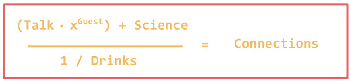

<h1 style="color:#e46161;" >Upcoming Event </h1>
<table style="width:100%">
  <tr>
     <td><h3 style="color:#cbf078;">When?</h3>
     
<h4 style="color:#f8f398;" > Thursday January 18th 2018    5:00 pm </h4>

     </td>
     <td>
     </td>
  </tr>
</table>

<h3 style="color:#cbf078;">Where?</h3>

Area di Ricerca P. Castellino  
via P.Castellino 111 Napoli  
Piano Rialzato - Stanza 11  
<a href="https://goo.gl/maps/z6bRfCnBibv">check on the map</a>

<h3 style="color:#cbf078;">Who?</h3>

The only way to know who is the speaker is to come to the Talk&amp;Drinks! The identity of the guest will be kept secret until the very last minute.

<h1 style="color:#e46161;">2017/2018 Talk&amp;Drinks</h1>

<table style="width:100%">
  <tr>
     <td>
     
<h4 style="color:#f8f398;" > Thursday December 14th 2017    5:00 pm   Speaker: Marco Salvemini </h4>

     </td>
     <td>
     </td>
  </tr>
</table>

<h1 style="color:#e46161;">What are the Talk&amp;Drinks?</h1>

Talk&amp;Drinks is a relaxed scientific discussions that take place every month, usually on a Thursday afternoon. 

 We hosts a secret guest every time to discuss about science in a broad sense: we talk about genetics, physics archeology, computers, technology and more and more... 
  

 We foster creative collaborations and aim to establish a critical mass of scientists in the Research Area where we work. 

 Talk&amp;Drinks is an open event, if you want to subscribe to our low traffic mailing list
<a href="http://list.igb.cnr.it/mailman/listinfo/talk_and_drinks">click here</a>

 Talk&amp;Drinks is a self-supported event, we rely on your contribution, especially for ideas 

<h1 style="color:#e46161;">Who runs the Talk&amp;Drinks?</h1>

We are researchers with passion for science and a willingness to reach out and talk with people

<table style="width:100%">
  <tr>
     <td> 
<a href="http://ibbr.cnr.it/ibbr/people/alessandra-rogato"> Alessandra Rogato</a>
       Marine Genetics 

     </td>
     <td>
     </td>
  </tr>

  <tr>
    <td> 
 <a href="http://www.igb.cnr.it/popgenlab"> Enza Colonna </a>
      Population Genetics and Human Evolution 

    </td>
    <td>
    </td>
  </tr>

  <tr>
     <td> 
<a href="http://www.igb.cnr.it/staff/people/lonardoe"> Enza Lonardo </a>
       Gastrointestinal Cancer

      </td>
      <td>
      </td>
  </tr>

  <tr>
     <td> 
 <a  href="http://star.evosexdevo.eu" > Marco Salvemini </a>
       Molecular Genetics and Insect Pest Control 

      </td>
      <td>
      </td>
  </tr>

  <tr>
     <td>
 <a href="http://www.igb.cnr.it/staff/people/tarallo">Valeria Tarallo</a>
       Cancer and Angiogenesis

      </td>
      <td>
      </td>
  </tr>

</table>

<h1 style="color:#e46161;">Past contributors </h1>
<table style="width:100%">
  <tr>
  <td>Edoardo De Tommasi
  </td>
  <td>
  </td>
</tr>

<tr>
   <td>Ombretta Guardiola
    </td>
    <td>
    </td>
</tr>

<tr>
   <td>Valeria Zazzu  
    </td>
    <td>
    </td>
</tr>

</table>

<h1 style="color:#e46161;">Past editions</h1>

<h1 style="color:#e46161;">Sponsor</h1>
<a href="http://www.contradeditaurasi.it/">Cantine Lonardo</a> supports "Drinks" at Talk&Drinks! 

